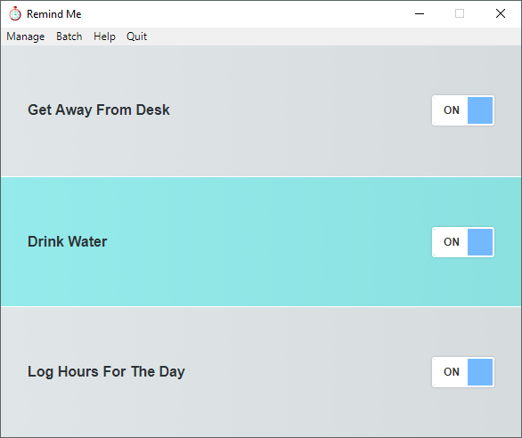

# Remind Me

A simple desktop application allowing you to create and schedule re-occurring personal reminders.

An [Electron](https://www.npmjs.com/package/electron) JS powered app using [React](https://www.npmjs.com/package/react), [Redux](https://www.npmjs.com/package/redux), [SASS](https://sass-lang.com), compiled with [Typescript](https://www.npmjs.com/package/typescript) and [Webpack](https://www.npmjs.com/package/webpack).

## Features

- Multiple reminders can run simultaneously
- Reminder times are using [cron syntax](https://www.npmjs.com/package/node-cron#cron-syntax)
- Audio notification with ability to add custom MP3 files to use
- Enable/disable reminders to auto run when app starts
- Option to focus on app when reminder triggers, or just in the background.
- `DEV MODE:` Live reload on code changes

## Download

You can download the latest release [here _(v1.0.1)_](https://github.com/mraffaele/remindme/releases/).

## Usage

Clone the repository
`git clone https://github.com/mraffaele/remindme.git`

Perform an install
`npm i`

Run the application from project root (Boots the app and live reloads code changes):
`npm run dev`

`npm run package-win` Packages into a Window executable in `projectRoot/release-builds`

`npm run package-mac` Packages into a Mac application in `projectRoot/release-builds`

## Entry points

`./main.js` - The Electron main process

`./src/index.tsx` - The Electron Renderer process (the App core)

`./src/sass/index.scss` - The SCSS entrypoint

## Credits

The following assets are used in the app:

- `001.mp3` from [https://www.zapsplat.com/music/tibetan-singing-bowl-music-instrument-play-eerie-dark-calm-decay-swell-meditate/](https://www.zapsplat.com/music/tibetan-singing-bowl-music-instrument-play-eerie-dark-calm-decay-swell-meditate/)
- `002.mp3` from [https://www.zapsplat.com/music/notification-accept/](https://www.zapsplat.com/music/notification-accept/)
- `003.mp3` from [https://www.zapsplat.com/music/mobile-phone-notification-tone-3/](https://www.zapsplat.com/music/mobile-phone-notification-tone-3/)
- `App Icon` from [https://www.flaticon.com/free-icon/stopwatch_189106](https://www.flaticon.com/free-icon/stopwatch_189106)
- A handy [Cron Generator](https://crontab.guru)

Big thanks to the creators.
